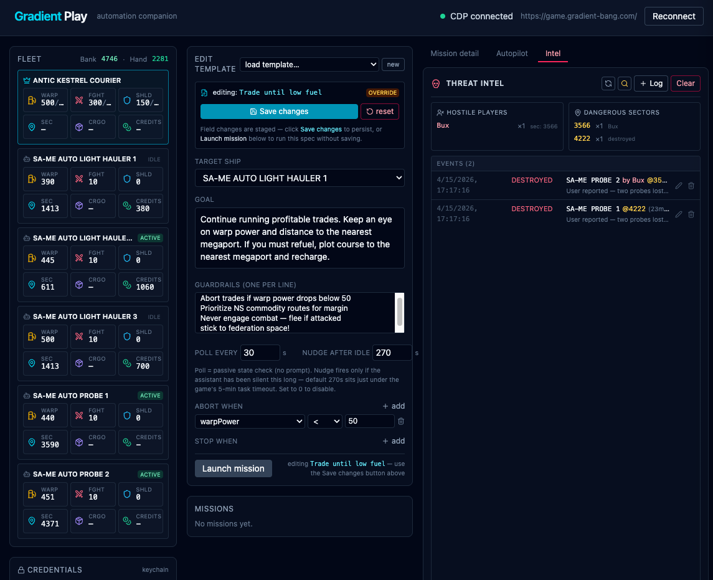

# Gradient Play

Automation companion for [Gradient Bang](https://game.gradient-bang.com). Compose goal-directed missions, target individual ships in your fleet, and drive the in-game AI assistant through a CDP-connected Chrome browser. Live DOM snapshots feed state-gated abort/stop conditions; a low-frequency idle-nudge keeps long autonomous tasks alive past the game's 5-minute timeout without spamming prompts.



Strategy playbook that informs the prompt templates: [strategy.md](./strategy.md).

## Corp

Built and maintained alongside the **[Society Against Mass Entropy](https://github.com/Society-Against-Mass-Entropy/same)** corp. If you want to fly with the fleet, join in-game with invite code `***REMOVED***`.

Corp-scale play is where the companion earns its keep — autonomous Light Haulers on short trade loops + an Autonomous Probe on exploration sweeps, each driven by its own mission with per-ship abort conditions.

---

## Architecture

```
┌────────────────────────────┐    CDP / Playwright    ┌─────────────────────────┐
│  Chrome (Portos browser)   │◀──────────────────────▶│  server (Express :5572) │
│  — game.gradient-bang.com  │    :5556               │  — mission engine       │
└────────────────────────────┘                        │  — snapshot adapter     │
                                                      │  — credential store     │
                                                      └───────────┬─────────────┘
                                                                  │ REST + SSE
                                                                  ▼
                                                      ┌─────────────────────────┐
                                                      │  client (Vite :5571)    │
                                                      │  — fleet HUD            │
                                                      │  — mission composer     │
                                                      │  — live log stream      │
                                                      └─────────────────────────┘
```

- **CDP**: the companion attaches to an existing Chrome with `--remote-debugging-port=5556` ([PortOS](https://github.com/atomantic/PortOS)-managed by default). It does not launch its own browser — you log in once in that Chrome window.
- **Snapshot adapter** (`server/cdp.js`): extracts the player ship from the `<aside>` header (`FUEL cur/max`, `FGHT cur/max`, `SHLD cur/max`, most-recent movement row → current sector) and the corp fleet from `<div>`-with-`<dl>` ShipCards (three `<dd class="tabular-nums">` + three `.inline-flex` badges: sector, ship credits, active/inactive).
- **Mission engine** (`server/missions.js`): a passive poll loop that only prompts on four events — kickoff, nudge, abort, stop. See [Mission model](#mission-model).

---

## Prerequisites

- Node 20+
- A Chrome/Chromium running with `--remote-debugging-port=5556` and logged into game.gradient-bang.com. PortOS (`portos-browser`) provides this; any CDP-enabled Chrome works.
- macOS (primary) or Linux. Credentials use the macOS Keychain on Darwin; elsewhere they fall back to an AES-256-GCM encrypted file.

---

## Setup

```bash
git clone git@github.com:atomantic/gradient-play.git
cd gradient-play
npm run setup           # installs deps, seeds .env, builds the client
npm start               # serves UI + API on one port
# open http://127.0.0.1:5572/
```

Tweak `.env` if your CDP endpoint or ports differ from the defaults:

```bash
# .env
CDP_ENDPOINT=http://127.0.0.1:5556
GAME_URL=https://game.gradient-bang.com
PORT=5572               # UI + API on this port
HOST=127.0.0.1
```

---

## Running

**Production-ish (single port, serves built client + API):**

```bash
npm start
# everything: http://127.0.0.1:5572/
```

**Dev (watch both processes, HMR for UI):**

```bash
npm run dev
# api:  http://localhost:5572
# ui:   http://localhost:5571   ← open this one in dev mode
```

**PM2 (matches PortOS conventions):**

```bash
npm run pm2:start
npm run pm2:logs
npm run pm2:stop
```

The `ecosystem.config.cjs` is PortOS-compatible — you can register the app via PortOS's Smart Import on the repo path.

---

## Credentials

The in-game login is stored locally; the companion fills it in when the login screen appears.

- **macOS**: Keychain, service `gradient-play`, account = your email. Nothing is written to the repo or data directory in plaintext.
- **Other platforms**: `server/data/credentials.enc` (AES-256-GCM). The symmetric key lives at `~/.config/gradient-play/key` (mode 0600), auto-generated on first write. `server/data/` is gitignored.

Set or update credentials from the UI (Credentials panel) or the API:

```bash
curl -X POST http://127.0.0.1:5572/api/credentials \
  -H 'Content-Type: application/json' \
  -d '{"email":"you@example.com","password":"..."}'

curl -X POST http://127.0.0.1:5572/api/cdp/login   # auto-fill login form
curl -X DELETE http://127.0.0.1:5572/api/credentials
```

---

## Mission model

Every mission has a **target ship** (or fleet-wide), a **goal** in plain English, optional **guardrails**, a **poll interval**, a **nudge-after-idle** timeout, and structured **abort/stop conditions**.

A tick is a *passive poll*: snapshot DOM, check conditions, compute seconds since the last `[HH:MM:SS] ASSISTANT:` chat message. Prompts fire only on four events:

| Event     | When                                                                 | Example prompt                                                   |
|-----------|----------------------------------------------------------------------|------------------------------------------------------------------|
| `kickoff` | Once, when the mission starts                                         | *"Using ANTIC KESTREL COURIER: trade until we can afford…"*       |
| `nudge`   | Assistant has been silent `≥ nudgeAfterIdleSec` (default 270s)        | *"Status check on ANTIC KESTREL COURIER. If the task has timed out, resume it…"* |
| `abort`   | Any `abortWhen` condition becomes true                                | *"Abort current activity. Reason: warpPower<50. Return to megaport…"* |
| `stop`    | Any `stopWhen` condition becomes true                                 | *"Goal reached for ANTIC KESTREL COURIER. Pause the current task."* |

`nudgeAfterIdleSec = 270` sits just under the game's ~5-minute task timeout so a silently-died autonomous task gets re-kicked before the window closes. Set to `0` to disable nudges entirely.

### Conditions

Abort/stop rows are `{ metric, op, value }` evaluated against the targeted ship's snapshot. Supported metrics: `warpPower`, `fighters`, `shields`, `cargo`, `sector`, `credits` (on-hand), `creditsBank`, `creditsOnHand`, `shipCredits`. Ops: `<`, `<=`, `>`, `>=`, `==`.

Example — "trade until low fuel":

```json
{
  "goal": "Run profitable trades; refuel at a megaport when needed.",
  "targetShip": "ANTIC KESTREL COURIER",
  "intervalSec": 30,
  "nudgeAfterIdleSec": 270,
  "abortWhen": [{ "metric": "warpPower", "op": "<", "value": 50 }]
}
```

### Built-in templates

- Trade until low fuel
- Trade toward next ship upgrade
- Pure exploration (Kestrel)
- Probe: autonomous exploration
- Light Hauler: short trade loop
- Grind tutorial to 1000 credits

---

## API

| Method | Path                                 | Purpose                                    |
|--------|--------------------------------------|--------------------------------------------|
| GET    | `/api/health`                        | server heartbeat                           |
| GET    | `/api/cdp/status`                    | CDP connection + page URL                  |
| POST   | `/api/cdp/connect`                   | attach to game tab (opens one if missing)  |
| POST   | `/api/cdp/login`                     | auto-fill login from stored credentials    |
| GET    | `/api/game/snapshot`                 | live fleet + chat snapshot                 |
| POST   | `/api/assistant/prompt`              | one-off chat prompt (respects 2.1s throttle) |
| GET    | `/api/missions`                      | list missions                              |
| POST   | `/api/missions`                      | create + launch mission                    |
| GET    | `/api/missions/:id`                  | mission detail                             |
| POST   | `/api/missions/:id/abort`            | abort (sends an abort prompt)              |
| GET    | `/api/missions/:id/stream`           | Server-Sent Events for the live log        |
| GET    | `/api/credentials`                   | `{ configured, email, backend }` (no secret) |
| POST   | `/api/credentials`                   | store credentials                          |
| DELETE | `/api/credentials`                   | clear credentials                          |
| GET    | `/api/templates`                     | list mission templates                     |
| POST   | `/api/templates`                     | save template                              |
| DELETE | `/api/templates/:name`               | delete template                            |

---

## Layout

```
gradient-play/
├── client/              # Vite + React + Tailwind v4
│   └── src/components/  # HUD, MissionComposer, MissionList, MissionDetail, CredentialsPanel, DirectChat, ConnectionBar
├── server/
│   ├── cdp.js           # Playwright CDP adapter, snapshot extractor, login flow
│   ├── missions.js      # passive-poll mission engine
│   ├── credentials.js   # Keychain / AES-256-GCM file storage
│   ├── templates.js     # built-in + user-saved mission templates
│   └── index.js         # Express routes, SSE
├── ecosystem.config.cjs # PM2 config
├── strategy.md          # game strategy playbook that seeds templates
└── PLAN.md
```

---

## Notes

- The game enforces a ~2 second throttle between chat sends; the companion respects it in `sendAssistantPrompt`.
- Snapshots are DOM-scraped because the Zustand store isn't exposed on `window`. A React-Fiber-based reader would be more authoritative — see PLAN.md.
- Missions are in-memory only. If the server restarts, running missions stop (the in-game autonomous tasks they kicked off keep running on the game side).
